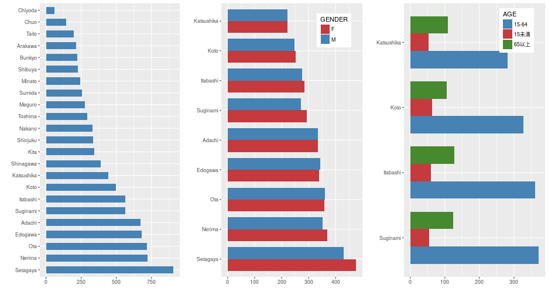

## Developing Data Products
---------------------

### Shiny App: Tokyo Population Map

Coursera Data Science Specialization  
Fritz Lin  
September, 21st 2017

---  

## Introduction

* This presentation is part of the [Coursera course on Developing Data Products](https://www.coursera.org/learn/data-products) 

* The **Shiny app** pitched by this presentation is at
https://alpenfritz.shinyapps.io/tokyopopmap/

* The Shiny app **source code** is available at
https://github.com/alpenfritz/tokyopopmap/tree/master/app

--- 

## Tokyo Population Map App

* The [Tokyo Population Map App](https://alpenfritz.shinyapps.io/tokyopopmap/) shows the population size in each of the 23 wards of Tokyo
    - population size of each ward is further subdivided by *gender* and *age*

* **Interactive Map** using `leaflet` package to show information
    - population sizes of wards highlighted by a **choeroplath map**
    - using **popups** to display information on each ward 

* **Bar graphs** for comparing general population sizes or population sizes by gender and age
    - possible to filter depending on population size using a **slider**

--- 

## Interactive Map

<iframe src="./assets/img/leaflet.html" width=100% height=500px allowtransparency="true"> </iframe>

--- 

## Bar Graphs

